##          **<center>中山大学数据科学与计算机学院本科生实验报告        </br>  （2019年秋季学期）  </center>**  

| 课程名称 | 区块链原理与技术 |   任课老师   |      郑子彬      |
| :------: | :--------------: | :----------: | :--------------: |
|   年级   |       17级       | 专业（方向） |     软件工程     |
|   学号   |     17343036     |     姓名     |      郭章旭      |
|   电话   |   15692416866    |    Email     | 691215689@qq.com |
| 开始日期 |    2019-10-23    |   完成日期   |    2019-12-08    |


### 一、项目背景

​		传统供应链由于交易信息的不透明化，信任关系不会逐级往下传递，从而导致了下游公司融资难的问题，同时也增加了金融机构进行评估的成本。

​		如果将供应链上的每一笔交易和应收账款单据上链，同时引入第三方可信机构来确认这些信息的交易，例如银行、物流公司等，确保交易和单据的真实性。同时，支持应收账款的转让，融资，清算等，让核心企业的信用可以传递到供应链的下游企业，减小中小企业的融资难度。

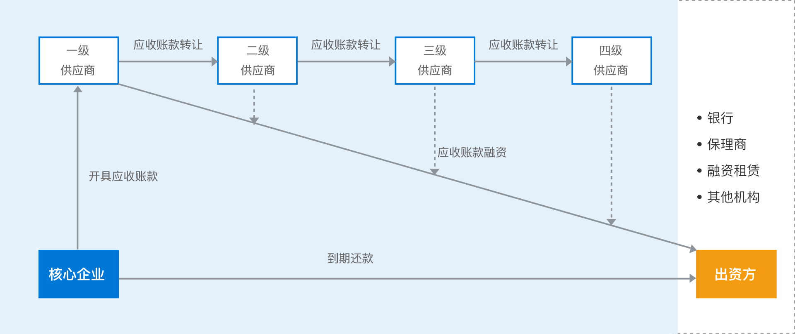

​		根据上图，我对于区块链在供应链中的应用理解如下：首先该智能合约是要由核心企业来部署的，只有核心企业才可以开具应收账款、而一级供应商可以根据自己的情况去拆分核心企业所开具的应收账款，也可以拿去银行融资，由于核心企业开具应收账款这一个操作是由智能合约调用的，因此记录在了链上，二级供应商或银行都可以在链上查看这份应收账款是否真实有效，确保了可信性。二级供应商到三级供应商或二级供应商去融资也是同样的道理。核心企业到期还款的时候，因为每次拆分或融资都会记录在链上，所以核心企业只需要查看链上的所有应收账款的收款人地址和金额即可完成还款，而无需再花时间去验证这些子应收账款是否可信。

### 二、方案设计

#### 存储设计

​		在智能合约中，最主要的是Receipt这个结构体，这个结构体保存了应收账款的欠款方、收款方，金额、还款日期等重要信息，无论是拆分账款、融资、还是结算，都得用到。

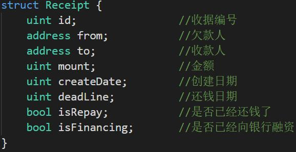

​		然后还有就是地址与名字、余额、应收额的映射，这里主要用于显示调用是否正确，在现实中，余额通过实际的现金支付来变化。

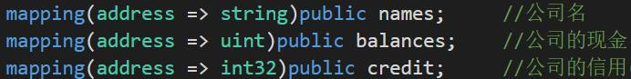


#### 数据流图  

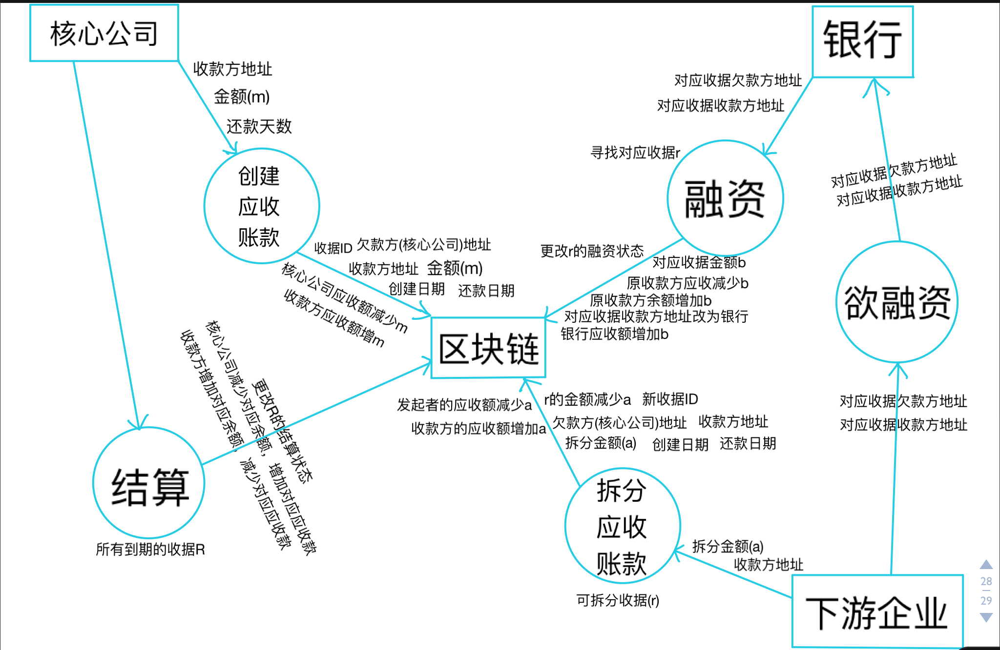


#### 核心功能介绍  

##### 智能合约

###### 构造函数

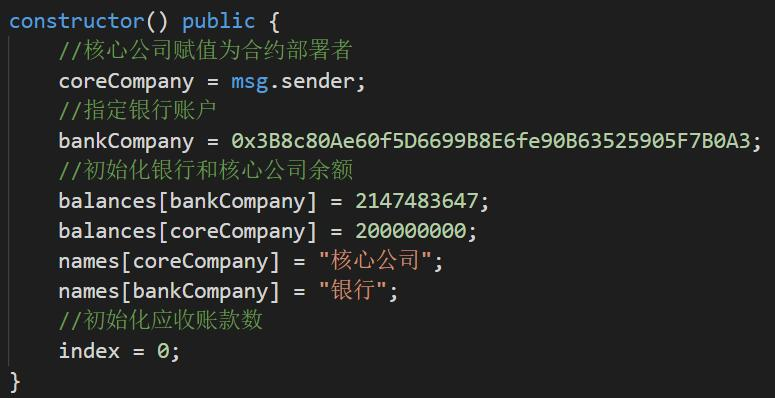

​		这里除了指定核心公司之外，还得指定银行的公钥地址，这是因为融资的时候，只有银行验证真实有效之后才可以将现金发放给想融资的企业。


###### 创建应收账款

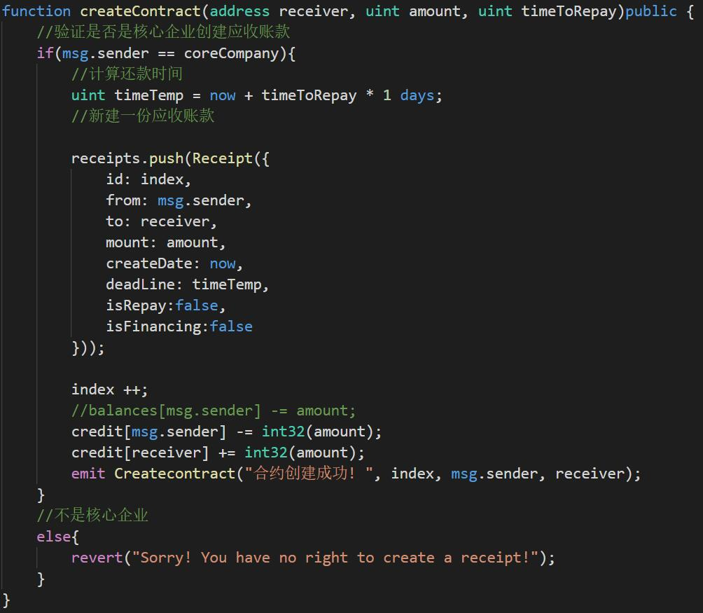

​		首先执行该函数的时候先验证调用的用户是否为核心企业，若是才能正常开具应收账款，否则没有权利去开具。然后根据企业之间给定的还款期限，去计算还款日期，然后新建一份应收账款并加入到存储所有应收账款的数组中。credit是用来记录用户的欠款和应收款的总额。


###### 拆分应收账款

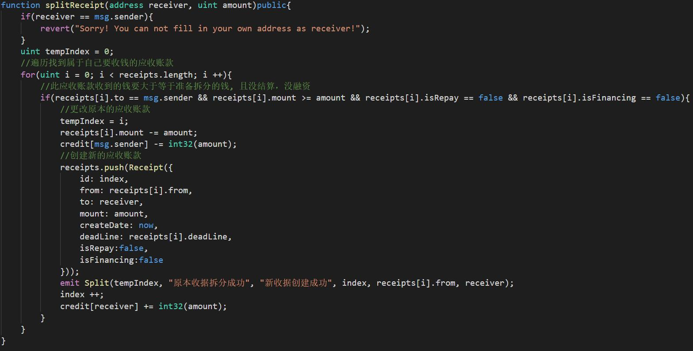

​		首先是拆分的发起方找到属于自己收款的应收账款，找到后判断一下该份应收账款的金额是否大于等于拆分金额，如果是则进行拆分，将原本应收账款的金额减去拆分金额，新建的应收账款的信息除了id、收款人、金额、创建日期不同以外，其他与原本应收账款一样。为了防止企业把结算了的或者融资了的应收账款再进行拆分，拆分前再添加了两个条件：该应收账款没有被结算或者没有被融资。


###### 融资应收账款

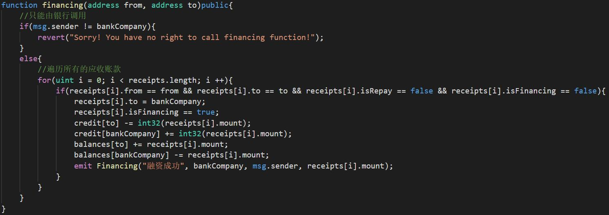

​		思路很简单，就是把要融资的应收账款的收款人改成银行的地址，然后融资的企业现金金额增加就好了。调用这个函数必须由银行来操作，因为现金只能由银行来发行。想融资的企业，只需将应收账款中的欠款方地址和收款方地址告诉银行即可。


###### 结算

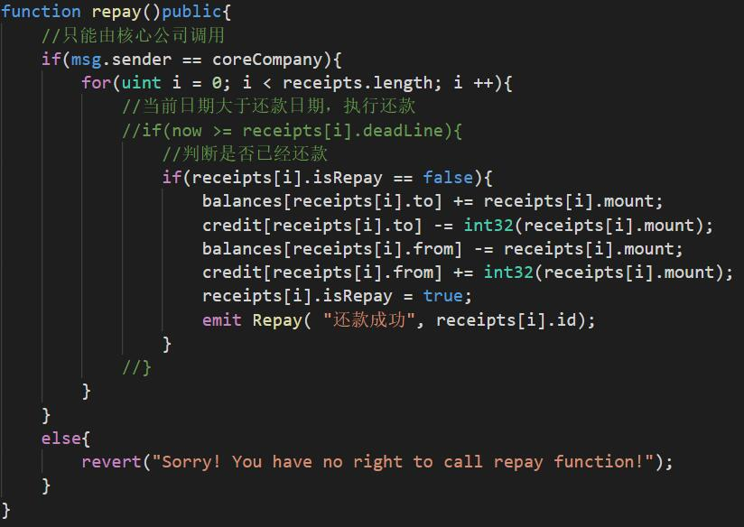

​		结算函数只能由核心公司调用，原本的思路是遍历存放所有应收账款的数组，把到期还款的而还没结算的应收账款给结算掉，核心公司金额减少，对于收款人金额增加。在测试的时候，为了方便测试，我把判断当前日期是否大于还款日期的语句注释掉了，只要核心公司执行结算函数，就会把所有没结算的应收账款给结算掉。


###### 辅助函数

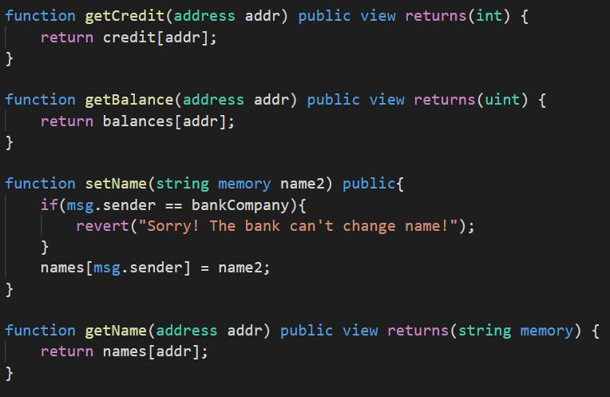

用于给前端显示和设置公司名字。


##### 利用Truffle框架部署合约

​		使用turffle命令初始化好项目后，只需要将智能合约放入contracts，然后根据自己的合约修改index.html和index.js即可获得一个网页版的区块链应用。

​		修改index.js使其可以调用合约的函数。

​		例如创建应收账款的函数：

```javascript
createContract: async function() {
    if(this.account != company){
        this.setStatus("Sorry! You have no right to create a receipt!", "status1");
    }
    else{
        const receiver = document.getElementById("create-receiver").value;
        if(receiver == this.account){
            this.setStatus("Sorry! You can not fill in your own address as receiver!", "status1");
        }
        else{
            const amount = parseInt(document.getElementById("create-amount").value);
            const time = parseInt(document.getElementById("create-repay").value);
            //console.log(amount);
            this.setStatus("Initiating receipt... (please wait)", "status1");

            const { createContract } = this.meta.methods;
            await createContract(receiver, amount, time).send({ from: this.account, gas: 6721975 });
            //await createContract(receiver, amount, time).estimateGas({from: this.account});
            this.setStatus("Create receipt completed!", "status1");
            this.refreshBalance();
            this.refreshCredit();
            //console.log('Create receipt complete!');
        }
    }
},
```

​		首先是通过网页的输入获得调用合约函数的必要参数，然后通过`const { createContract } = this.meta.methods`来找到智能合约中对应的函数，最后将参数传过去即可调用。由于在js中已经检查了当前账户是否为核心公司，所以智能合约该函数里检查调用者是否为核心公司并不会用到，如果在js中没有检查，则可以打开控制台来查看错误信息。其他函数的调用实现类似。

### 三、功能测试

#### 测试环境

Windows 10 1909

nodejs

npm

 ganache 

 truffle 

#### 测试说明

配置好上述所需要的环境后，终端输入命令` ganache-cli `，执行结果如下：

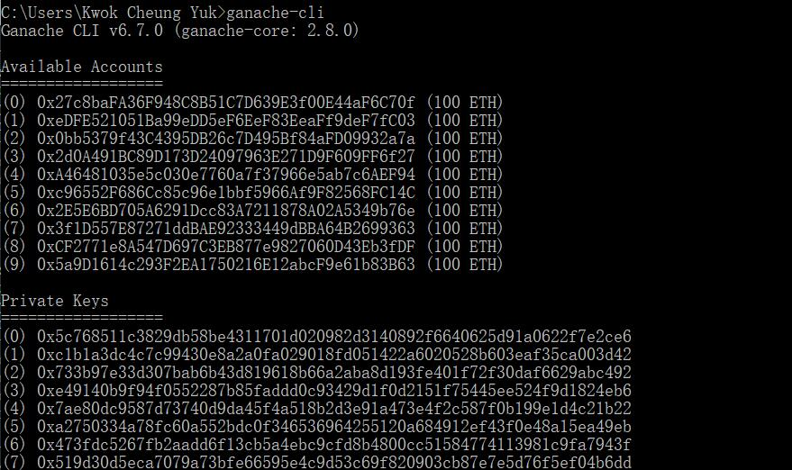

然后修改SupplyChainApp/contracts/SupplyChain.sol中的银行地址，ganache会给出10个地址，自行选一个即可：

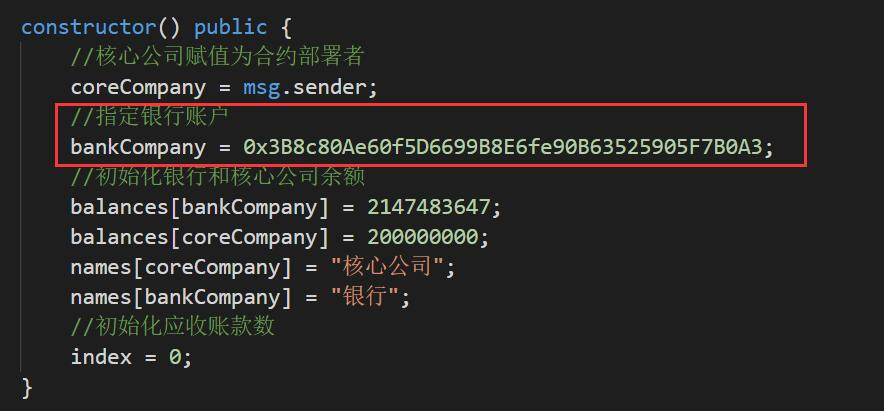

新建一个终端，进入到SupplyChainApp/app，执行命令`truffle migrate`：

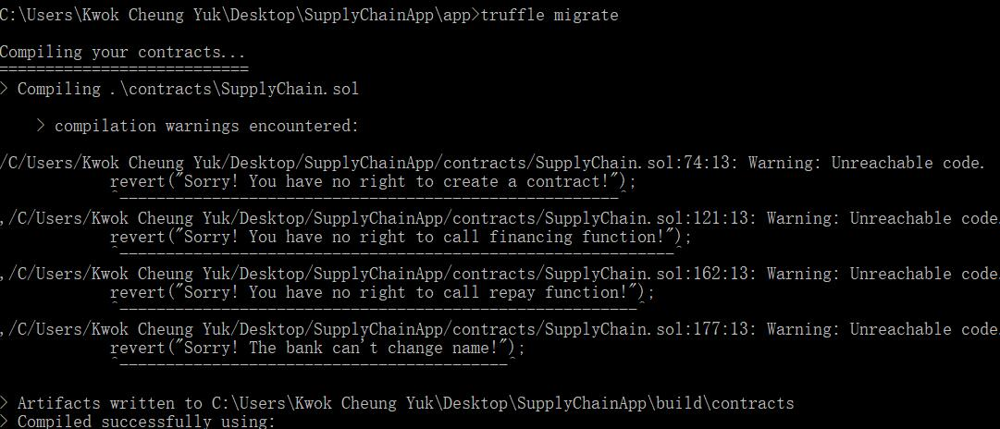

执行命令`npm run dev`运行服务器：

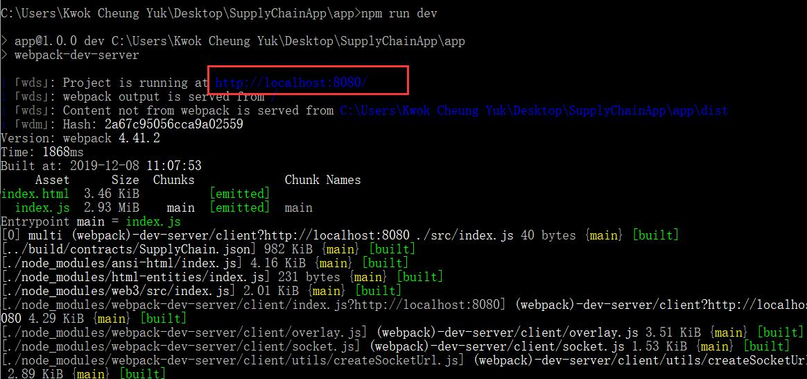

浏览器输入[http://localhost:8080/](https://blog.csdn.net/gzx1002/article/details/103110197)进行访问。

#### 更改公司名字

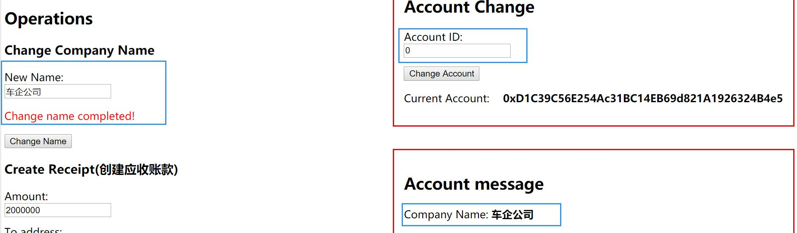


#### 创建应收账款

创建成功后，车企公司(核心公司)的应收账款总额减少，轮胎公司应收账款总额相对于增加：

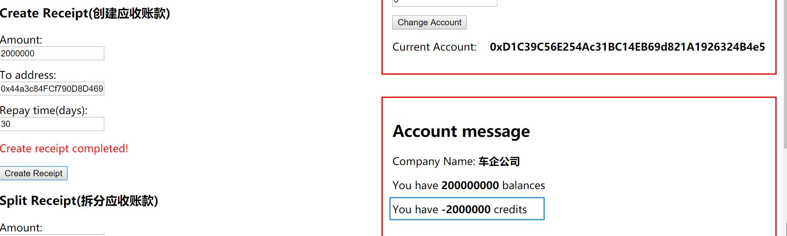

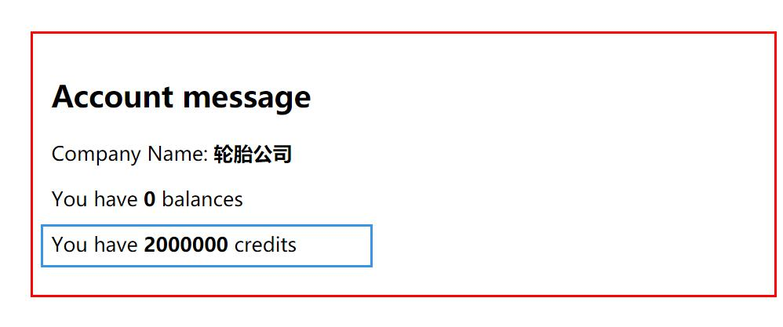


#### 拆分应收账款

轮胎公司将应收账款拆分成功后，轮胎公司应收账款总额减少对于金额，轮毂公司应收账款总额对于增加：

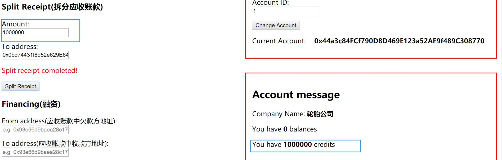

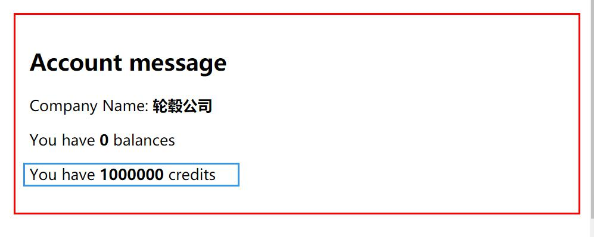


#### 融资

融资前银行余额：

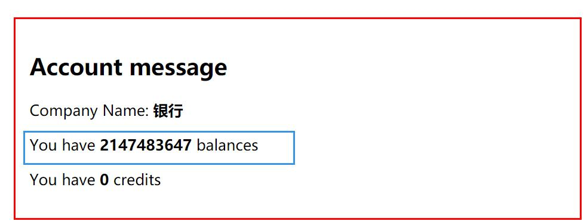

融资成功后银行和下游小企业的余额：

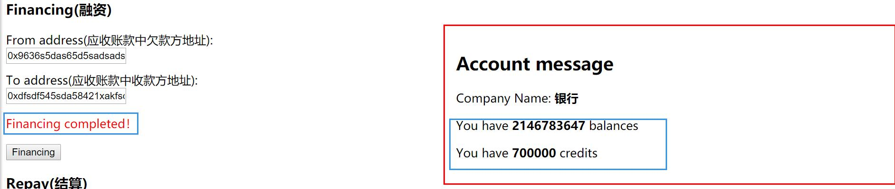

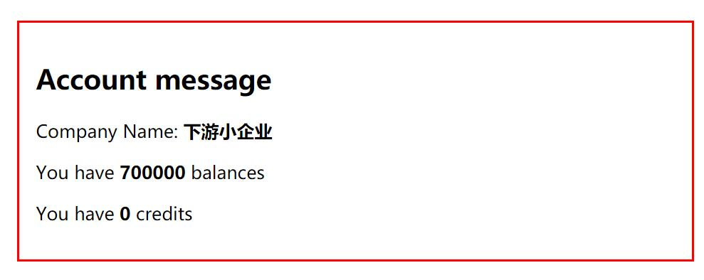


#### 结算

结算后各家公司的余额和营收额变化：

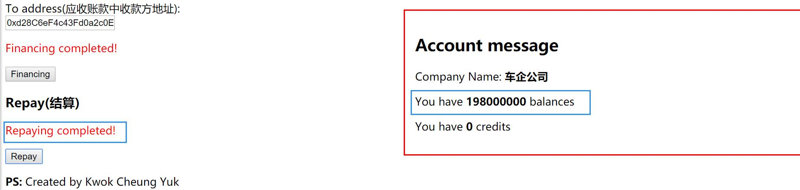


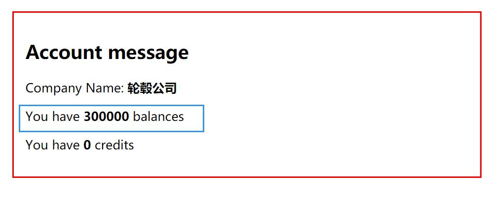


### 四、界面展示

​		界面是用truffle框架搭建的，比较简陋，左边是对应的一些操作，右上部分用于切换账户，右下部分用于显示账户信息，包括名字，余额，应收账款总额。

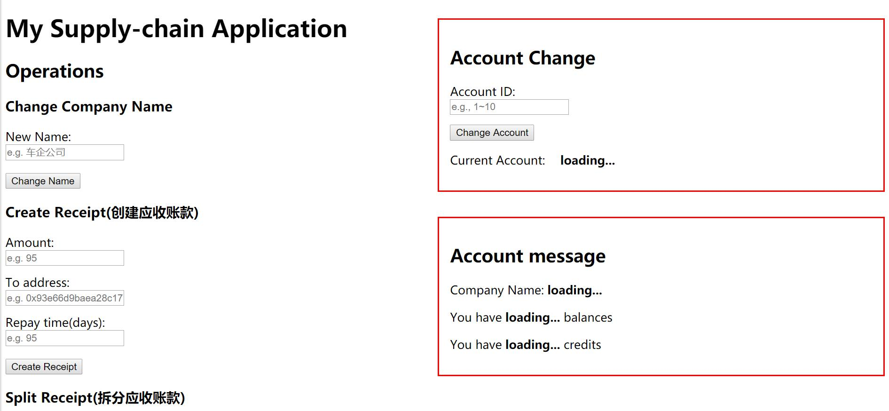

### 五、心得体会

​		从一开始以为区块链等价于比特币到现在自己可以完完整整写一个智能合约，做一个小应用，这个过程虽短，但是真的是挺不容易的。在这过程中，需要自己学的东西有很多，例如学习solidity的语法呀，如何编写一个合约、如何将合约部署到链上。微众银行的Webase让合约的部署，合约的测试变得简单多了。然后到后面链端前端后端相结合做成一个完整应用，一开始也是一脸懵逼的，不知道要如何做，后来在网上看到可以用truffle框架来构建，我就尝试了一下，慢慢磨，也做出来了，所幸自己之前学过一些HTML和JavaScript的语法，所以这一部分也不太难。而框架提供的demo中，也相当明白地表示了如何去调用合约中的函数，所以只要照葫芦画瓢，就可以做好了。当然我个人觉得，最令人费神的就是配置环境这一部分了，国内很多资源都墙了，还得想方设法“科学上网”，做完这个作业，我又一次感觉到国内网络对国内开发者的不友好了。。。。。。

​		《区块链原理与技术》这门课也逐渐接近了尾声，区块链技术相对来讲是比较新颖的，但是任课老师讲得很透彻，而且还找来了其他各领域厉害的老师来给我们讲相对应的知识点，更是找来了微众银行的专家来教我们如何完成大作业，这是很难得的一个机会。虽然课快上完了，但是对于区块链，我了解的只是很少很少，希望自己日后会有更多时间深入了解区块链这一个领域。


### [GitHub仓库](https://github.com/KwokCheungYuk/SupplyChainApp)

